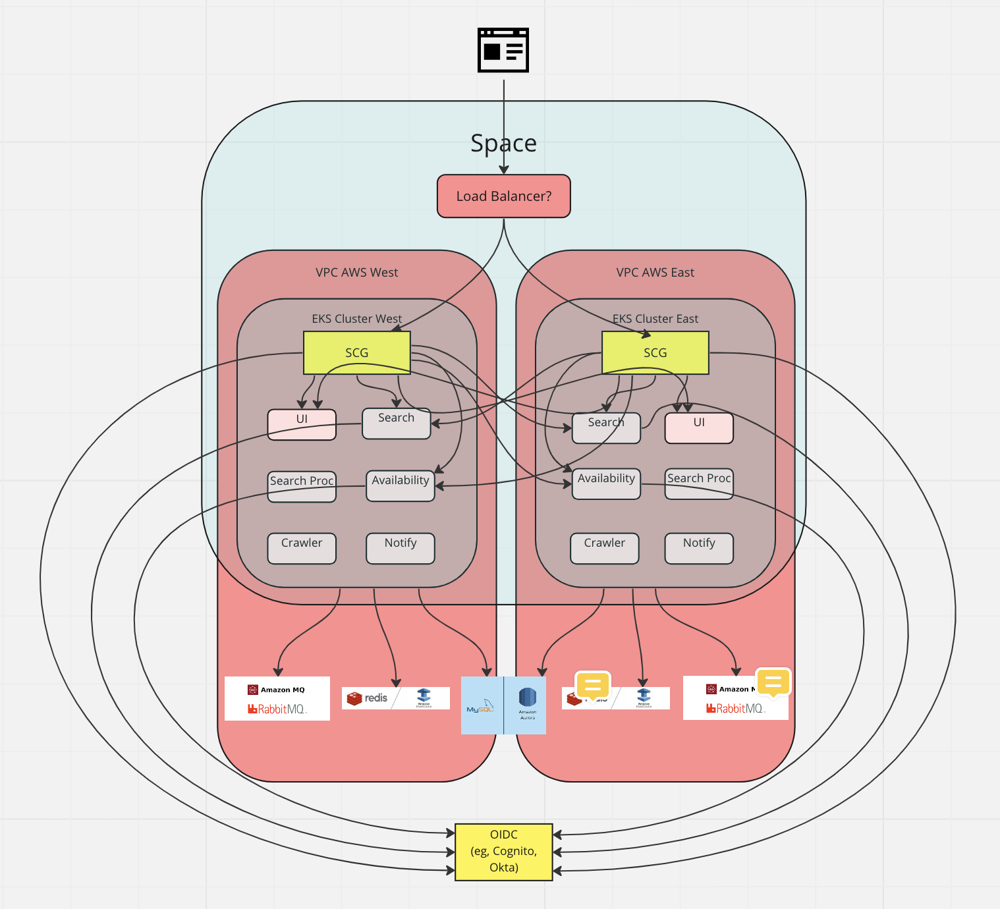

# Phase 1

The initial phase includes the least amount of automation and therefore requires multiple manual steps.  The following pages will outline high level steps for the
deployment of the various components of the phase 1 demo.

## Prerequisites and Assumptions

The following components, tools, and services are assumed:

- A registered DNS domain
- An AWS account with adequate permission to provision services and create IAM policies and roles.
    - AWS CLI and eksctl tools installed and configured
- Two provisioned EKS clusters running in separate US regions.  Both EKS clusters should be running at least Kubernetes 1.24 and on boarded to Tanzu Service Mesh.
- Tanzu Service Mesh (TSM) console access with access to the two clusters above.
    - A domain and TLS certificate configured in TSM for the Where For Dinner application domain.
- TanzuNet account with access to Tanzu Cluster Essentials and TAP 1.5.x
- Tanzu CLI and kubectl installed and configured to access the clusters above.
- ytt tool
- Pre-built carvel packages and GitOps repo of all the Where For Dinner workloads.


## Topology

The following diagram outlines the high level topology of the demo.



## Installation

### Install TAP

[Install](https://docs.vmware.com/en/VMware-Tanzu-Application-Platform/1.5/tap/install-intro.html) the TAP run profile on both EKS clusters using the deployment methodology of your choice.  For the sake of resource optimization, you may exclude the following packages from the run profile:
- eventing.tanzu.vmware.com
- cnrs.tanzu.vmware.com

### Create Names Spaces

Workloads are deployed into a runtime namespace that includes also necessary RBAC configuration.  In addition, a namespace for the Spring Cloud Gateway should also be
created due to interaction between the runtime namespace and the Spring Cloud Gateway operator.  There are various was to create a 
[runtime namespace](https://docs.vmware.com/en/VMware-Tanzu-Application-Platform/1.5/tap/namespace-provisioner-provision-developer-ns.html); this document 
will use a basic manual setup that utilizes the TAP namespace provisioner.

Create two namespaces using kubectl on each cluster: one for the Where For Dinner workloads and one for Spring Cloud Gateway

```
kubectl create ns where-for-dinner
kubectl create ns scg
```

If necessary, create a secret registry credential secret for the runtime namespace on each cluster:

```
tanzu secret registry add registry-credentials --server <OCI Registry Server> --username <username> --password <password>  --namespace where-for-dinner
```

Annotate the runtime namespace on each cluster to be managed by the runtime provisioner:

```
kubectl label namespaces where-for-dinner apps.tanzu.vmware.com/tap-ns=""
```

Finally, configuration Tanzu Service Mesh to manage these namespaces on both clusters (requires proper access in the TSM console).

### Install ESO Operator

The services offerings in this phase rely heavily on the use of external secrets stored in AWS secrets manager.  This will required the installation of the External Secrets
Operator (ESO) into the clusters.  The External Secrets Operator package is included as part of the TAP run profile.  To install the ESO package, run the following Tanzu CLI
command against each cluster (version number may differ):

```
tanzu package install eso --package-name external-secrets.apps.tanzu.vmware.com --version 0.6.1+tap.6
```

A `ClusterSecretStore` to be used with AWS secrets manager will configured later in this document.

### Install Spring Cloud Gateway

HTTP request routing is handle by Spring Cloud Gateway (SCG).  The SCG package is also included as part of the TAP run profile.  Spring Cloud Gateway needs to be installed
into the `scg` namespace which requires a custom values file to be created.  Create a file named `scg.yaml` and populate it with the following content:

```
deployment:
  namespace: scg
scgOperator:
  replicaCount: 1
```

To install the SCG package, run the following Tanzu CLI command against each cluster (version number may differ):

```
tanzu package install scg --package-name spring-cloud-gateway.tanzu.vmware.com --version 2.0.0+tap.3 --values-file scg.yaml
```

### Configure AWS CloudSecretStore

Connectivity secrets are stored in AWS secrets manager which is accessible to the clusters via External Secrets.  To retrieve secrets in secrets manager, a
`ClusterSecretStore` must be configured in each cluster.   There are multiple options for configuring a `ClusterSecretStore` that accesses AWS secrets; the demo
utilizes [EKS Service Account credentials](https://external-secrets.io/v0.5.1/provider-aws-secrets-manager/#eks-service-account-credentials).  This requires the creation
of a service account that is annotated with an AWS IAM role.  Subsequently the role must be created and associated with an appropriate IAM policy that grants access
to secrets in AWS secrets manager.  Instructions on creating service account to assume an IAM role can be found 
[here](https://docs.aws.amazon.com/eks/latest/userguide/associate-service-account-role.html).  Unless you have already installed the EBS CSI driver for your clusters, you
will likely need to [create an IAM OIDC provider](https://docs.aws.amazon.com/eks/latest/userguide/enable-iam-roles-for-service-accounts.html) for each cluster. 

In the instructions for creating a service account, the `my-policy.json` file should have the following contents replacing <region> and <account> with the cluster AWS
region and the AWS Account ID.  **NOTE** Make sure the region matches that region of cluster you are creating a service account for so you will need to modify the file
for each region; each cluster should have a different region.

```
{
    "Version": "2012-10-17",
    "Statement": [
        {
            "Effect": "Allow",
            "Action": [
                "secretsmanager:GetResourcePolicy",
                "secretsmanager:GetSecretValue",
                "secretsmanager:DescribeSecret",
                "secretsmanager:ListSecretVersionIds"
            ],
            "Resource": [
                "arn:aws:secretsmanager:<region>:<account>:secret:rds-db*",
                "arn:aws:secretsmanager:<region>:<account>:secret:rmq-broker*",
                "arn:aws:secretsmanager:<region>:<account>:secret:redis-cache*",
                "arn:aws:secretsmanager:<region>:<account>:secret:cognito-auth*"
            ]
        }
    ]
}
```

When creating the policy, use an appropriate policy name that matches the regions.  A possible naming template is `tap-eso-reader-<region>`.
For example, use the following command when creating the policy for us-west-1.

```
aws iam create-policy --policy-name tap-eso-reader-us-west-1 --policy-document file://my-policy.json --regsion us-west-1
```

The eksctl command may be the easiest method for creating the service account in each cluster.  Use the following command to create the service account and role 
keeping in mind that the policy name needs to be the correct policy for the given cluster/region.  The role name should also be appropriate for the region.

For example, use the following command when creating a service account for a cluster named `tap-west-1` in region us-west-1; replace the <account> placeholder with 
the AWS Account ID.

```
eksctl create iamserviceaccount --name eso-serviceaccount --namespace where-for-dinner --cluster tap-west-1 --role-name "tap-eso-role-tap-west-1" \
    --attach-policy-arn arn:aws:iam::<account>:policy/tap-eso-reader-us-west-1 --approve --region us-west-1
 ```
 
**NOTE** The above steps can be troublesome and error prone; is important the the policy content, names, and account, and region match correction, or the 
`ClusterSecretStore` and subsequent `ExternalSecrets` will fail to synch.

Finally, create a `ClusterSecretStore` in each cluster using the `secrets/eso/awsSecretStore.yaml` file replacing <region> with the appropriate AWS region that matches the
cluster's AWS region.

```
ytt -f awsSecretStore.yaml -f values.yaml -v aws.secmgr.region=<region>
```

### Install Service Offerings

Service offering are contained in sets of `XRD`, `Composition`, `ClusterInstanceClass`, and RBAC resources.  To install all service offering (including those under developement), 
run the following command from the `services/service-offerings` directory.

```
kubectl apply -f . --recursive
```

